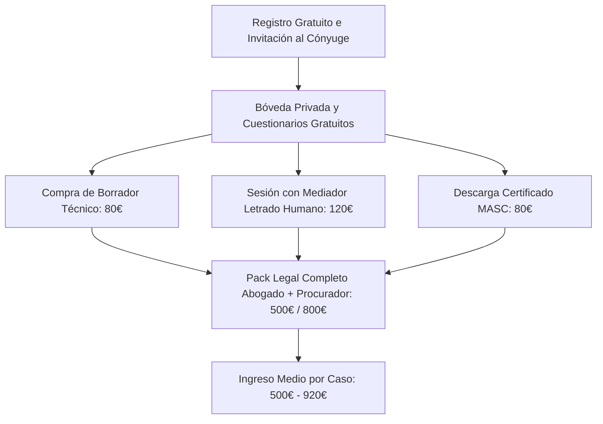

# Propuesta de Inversión: MediAción (LegalTech SaaS)
*Oportunidad de inversión en la automatización inteligente de la mediación familiar y convenios reguladores.*

---

## 🚀 Resumen Ejecutivo

**MediAción** es una plataforma disruptiva de **LegalTech SaaS** diseñada para transformar los procesos de divorcio y separación de mutuo acuerdo. A través de un enfoque híbrido de Inteligencia Artificial (IA) y asistencia legal humana, MediAción reduce drásticamente el coste, el tiempo y el desgaste emocional de las parejas, al tiempo que optimiza operativamente el trabajo de los profesionales legales.

La plataforma actúa como un **embudo de alta conversión** que acompaña al usuario desde una fase gratuita de preparación confidencial hasta servicios jurídicos cerrados de alto valor (abogado y procurador), resolviendo la ineficiencia histórica del sector legal tradicional.

---

## 📈 El Problema y la Oportunidad de Mercado

1. **Alto Coste y Complejidad:** Un divorcio contencioso o de mutuo acuerdo tradicional oscila entre los **1.200 € y 3.000 €** por cónyuge, sumando barreras burocráticas y honorarios opacos.
2. **Desgaste Emocional y Bloqueo:** La negociación cara a cara suele fracasar debido a la carga emocional. No existe un espacio neutro donde volcar posturas sin activar la hostilidad de la otra parte.
3. **Ineficiencia para Despachos:** Los abogados dedican entre el **70% y el 80% de su tiempo** en reuniones iniciales a recopilar datos desorganizados y mediar en disputas menores (ej. adjudicación del vehículo familiar o reparto de vacaciones), reduciendo su margen de beneficio por expediente.

**Tamaño del Mercado:** Millones de rupturas anuales a nivel global. Solo en España se registran más de 80.000 divorcios al año, donde el **85%** se tramitan de mutuo acuerdo o tienen el potencial de hacerlo si se proporciona la herramienta adecuada.

---

## 💡 La Solución: MediAción

MediAción propone un **Espacio de Mediación Neutral e Inteligente** donde cada cónyuge rellena de forma asíncrona y confidencial sus perfiles en su propia **Bóveda**. Un motor de IA procesa ambas posturas, elimina el lenguaje emocional u ofensivo, y genera propuestas de consenso objetivas y equilibradas en una **Mesa de Negociación** común. Una vez alcanzado el acuerdo, la plataforma automatiza la generación del **Convenio Regulador** listo para ratificación judicial.

---

## 💎 Ventajas Competitivas para el Usuario (Valor al Cliente)

* **Reducción de Costes (~70% de ahorro):** Acceso a un borrador preliminar gratuito, un convenio técnico redactado formalmente por **80 €**, certificado de incomparecencia MASC por **80 €** y tramitación judicial completa con abogado y procurador por una tarifa plana de **500 €** o **800 €** (compartible entre ambos) según el perfil del caso.
* **Entorno Asíncrono y Sin Presión:** Los usuarios responden cuestionarios adaptativos en su propio tiempo. No hay careos incómodos.
* **Bóveda Confidencial con IA:** El *"Diario de Desahogo"* permite canalizar la frustración emocional con la IA sin que la otra parte lo lea, facilitando que el usuario llegue calmado a la mesa común.
* **Propuestas Neutras y Basadas en la Ley:** El asistente de IA fundamenta las propuestas utilizando el marco legal (ej. Art. 90 y 97 del Código Civil español), eliminando la sensación de arbitrariedad.
* **Garantía y Acompañamiento:** Si la negociación encalla, pueden contratar un mediador letrado humano por solo **120 €** (2 horas de sesión virtual, 1h para cada parte) para desbloquear el punto exacto de conflicto antes de firmar.

---

## ⚙️ Ventajas Tecnológicas y Operativas (Valor al Desarrollador y Operador)

* **Estructura de Datos Limpia (Zero-Waste Input):** La IA recopila y estructura toda la información del caso en formato JSON normalizado. Cuando un expediente llega a manos del abogado humano para su firma, el **95% del trabajo de redacción e investigación está hecho**. El abogado solo valida y firma, multiplicando por 5 la cantidad de casos que puede procesar simultáneamente.
* **Arquitectura Altamente Escalable (SaaS):** Al basar la primera fase en interacciones web automatizadas guiadas por IA, el coste marginal de adquirir y procesar un nuevo usuario tiende a cero. No requiere aumentar personal de atención al cliente proporcionalmente a las ventas.
* **Desarrollo Modular y Moderno:** La aplicación está construida sobre **Next.js (App Router)**, **TypeScript** y **Tailwind CSS**. Esto permite:
  - Fácil mantenimiento e integración con LLMs a través de APIs seguras.
  - Migración directa a bases de datos relacionales robustas (ej. PostgreSQL) y backend seguro con servicios en la nube (ej. Firebase).
  - Escalabilidad de componentes visuales interactivos y transiciones fluidas con *Framer Motion*.
* **Simulador de Flujo Integrado:** El proyecto cuenta con un panel de control de simulación en caliente, reduciendo los tiempos de testing QA de nuevas funcionalidades en un **90%** al poder forzar cualquier estado del embudo en un clic.

---

## 💵 Modelo de Negocio y Monetización (Embudo de Conversión)

MediAción maximiza el *Customer Lifetime Value (LTV)* mediante un embudo transaccional progresivo:

1. **Acceso Freemium (Adquisición masiva):** Registro, vinculación de cónyuges y respuesta de cuestionarios sin coste.
2. **Micro-Transacción de Convenio (Bajo Ticket):** Descarga del borrador con validez legal por **80 €** o el Certificado MASC de desacuerdo por **80 €** (con gancho comercial: se les descuenta del pack final si deciden continuar con nuestros abogados).
3. **Mediador Express (Up-sell):** Contratación de sesiones de mediación humana especializada de 2 horas (1h por cónyuge) por **120 €** en caso de bloqueo.
4. **Trámite Judicial Completo (Alto Ticket):** Representación legal cerrada de mutuo acuerdo por **500 €** (casos sencillos) u **800 €** (casos con hijos o propiedades). Margen neto muy elevado debido a la automatización previa de la recopilación de datos y acuerdos.

---

## 🎯 Por Qué Invertir en MediAción

* **SaaS con Altos Márgenes:** Combina la escalabilidad de un software web con los ingresos consolidados del sector legal-tech.
* **Eficiencia Operativa Probada:** Convierte el servicio tradicional de abogacía (intensivo en mano de obra) en un proceso industrializado donde la tecnología realiza el pre-trabajo pesado.
* **Protección Legal y Cumplimiento:** Incorpora autenticación y verificación de identidad **KYC biométrica** simulada, preparando la plataforma para firmas digitales legalmente vinculantes bajo normativas europeas e internacionales.
* **Tracción y Escalabilidad:** El producto está diseñado para ser localizado fácilmente a cualquier código civil o legislación estatal adaptando únicamente los prompts legales y las plantillas de los convenios.
